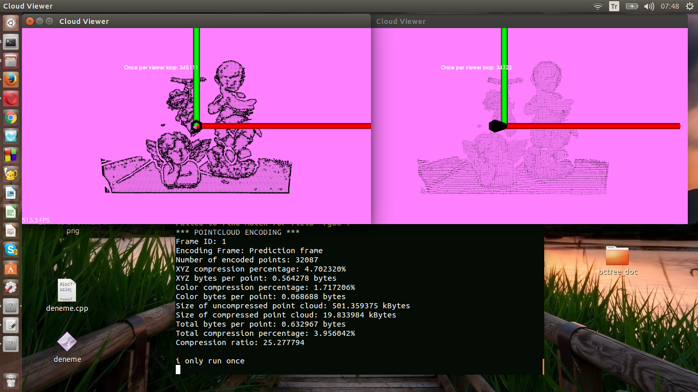
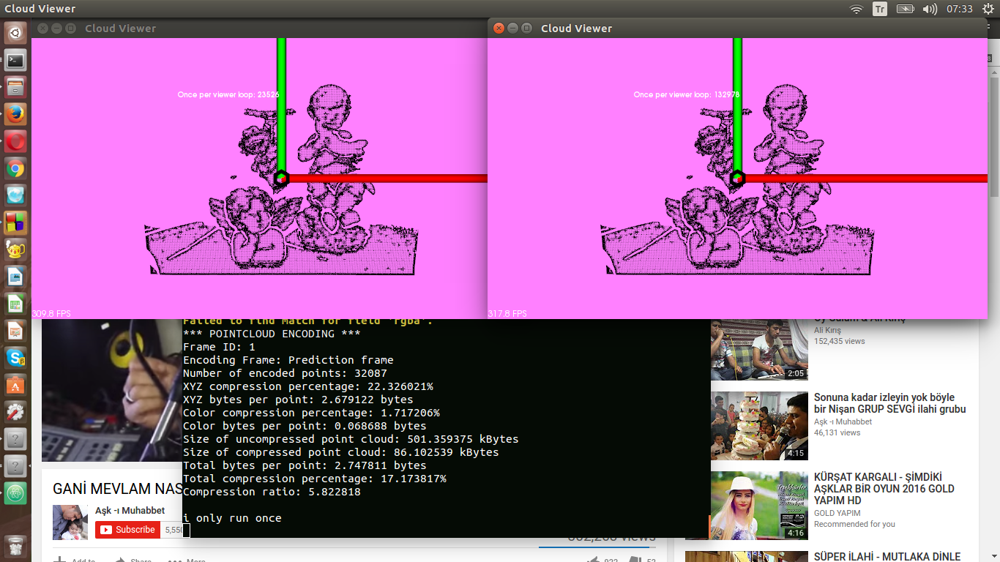
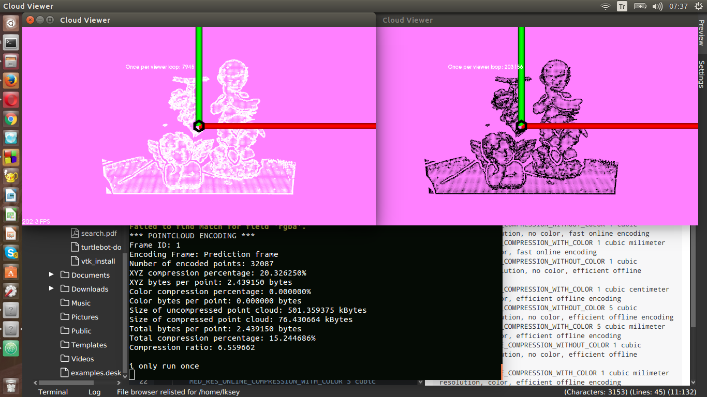

= POINT CLOUD LIBRARY

Point Cloud Library (PCL) açık kaynaklı 3 boyutlu görüntü işleme kütüphanesidir. PCL kütüphanesi filtreleme, öznitelik tahmini, yüzey inşâsı, kayıt, model uydurma ve bölgelere ayırma algoritmalarını içermektedir. PCL araştırmacı ve mühendislerden oluşan büyük bir konsorsiyum tarafından geliştirilmektedir. C++ diliyle yazılmıştır ve BSD lisansı altında sürülmüştür.

PCL çalistirabilmek için yüklenmesi zorunlu birkaç kütüphane vardır.

**Boost** = C ++ programlama dili için lineer cebir, sahte rastgele sayı üretme, çok iş parçacılığı, görüntü işleme, normal ifadeler ve birim test gibi görevler ve yapılar için destek sağlayan bir dizi kütüphanedir.

**FLANN**=N boyutlu uzaylarda hızlıca yaklaşık komşu aramaları gerçekleştirmek için kullanılan bir kütüphanedir.
En yakın komşu arama için en iyi sonucu bulduğumuz algoritmalar ve veri kümesine bağlı olarak en iyi algoritmayı ve optimum parametreleri otomatik olarak seçen bir sistem içerir.

*Eigen*=Lineer cebir, matris ve vektör işlemleri, geometrik dönüşümler, sayısal çözücüler ve ilgili algoritmalar için geliştirilmiş bir C ++ kütüphanesidir.

*Vtk* = 3B bilgisayar grafikleri, görüntü işleme ve görselleştirme için açık kaynaklı ve serbestçe bulunan bir yazılım sistemidir.VTK, skaler, vektör, tensör, doku ve hacimsel yöntemler gibi çok çeşitli görselleştirme algoritmalarını ve çokgen azaltma, örgü düzeltme, kesme, şekillendirme ve Delaunay üçgenleştirme gibi gelişmiş modelleme tekniklerini destekler.

Kurulumlar Ubuntu 14.04 üzerinde gerçeklenmiştir.Bazı kütüphaneleri diğer ubuntu sürümleri deskteklememektedir.

Ubuntu terminale asagıdaki komutlar sırasıyla girilerek
boost flann ve eigen kütüphaneleri yüklenir.

----
sudo apt-get install -y libboost-all-dev

sudo apt-get install -y libeigen3-dev

sudo apt-get install -y libflann-dev
----

_VTK kurulumu_

----
git clone git://vtk.org/VTK.git[git://vtk.org/VTK.git]
----

-----
mkdir VTK-build
cd VTK-build
cmake /path/to/VTK
make -j4
sudo make install
-----

_PCL kurulumu_

PCL lin kaynak dosyası indirilir.Zip içerisinden çikarıldıktan sonra asagidaki komutlar ile kurulumu gerçeklenir.
----
mkdir build
cd build
cmake ..
make -j4
sudo make install
----

PCL li Ubuntu konsoldan asagıdaki komutlar ilede kurulum yapılabilir. 
----
sudo add-apt-repository ppa:v-launchpad-jochen-sprickerhof-de/pcl
sudo apt-get update
sudo apt-get install libpcl-all
----

PCL C++ Proje Derleme
[bash,]
----
mkdir build
cd build
cmake ..
make
./point_cloud_compression
----

*_Octree_*

Üç boyutlu nesnelerin gösteriminde kullanılan ve özyineli biçimde bir nesnenin her bir alt hacmini sekiz eşit parçaya ayırarak sürdürülen çözümleme. İki boyutlu imgelerde dörtlü ağaç "quadtree" kullanılır.

Bir oktree, her iç düğümün tam sekiz çocuğa sahip olduğu bir ağaç veri yapısıdır. Octrees, üç boyutlu bir alanı, sekiz oktant olarak tekrar tekrar bölünerek bölmek için kullanılır. Octrees, quadtrees'in üç boyutlu benzeridir.

*_Noktasal Bulut Sıkıştırma(Point Cloud Compression)_*

Nokta bulutları, mesafe, renk, normaller vb. gibi ek bilgilerle ilişkili üç boyutlu noktaları tanımlayan büyük veri setlerinden oluşur. Ayrıca, yüksek çözünürlükte olabilir ve dolayısıyla önemli miktarda bellek kaynağı kullanılabilir. Nokta bulutlarının hız sınırlı iletişim kanalları üzerinden depolanması veya iletilmesi gerektiğinde, bu tür verileri sıkıştırmaya yönelik yöntemler son derece önemli hale gelir. Point Cloud Library, nokta bulutu sıkıştırma işlevselliği sağlar. Mevcut olmayan nokta referansları, nokta boyutu, çözünürlüğü, yoğunluğu ve / veya nokta sıralamasını değiştirerek karakterize edilen "unorganized" nokta bulutları da dahil olmak üzere her türlü nokta bulutunun kodlanmasına izin verir. 

http://www.pointclouds.org/documentation/tutorials/compression.php#octree-compression

sitesinde sunulan örnekte,OpenNIGrabber ile yakalanan noktaları PCL point cloud sıkıştırma teknikleri kullanılarak sıkıstırılmıstır.Biz bu ornegi herhangi bir pcd dosyasını sıkıştırmada kullanılacak hale getirdik.Point cloud sıkıştırmak için çeşitli profiller vardır bunların özellikleri aşağıda belirtilmiştir.

point_cloud_compression.cpp dosyani aciklayacagiz.

*_Sıkıştırma Profilleri_*

        LOW_RES_ONLINE_COMPRESSION_WITHOUT_COLOR 1 cubic centimeter resolution, no color, fast online encoding
        
        LOW_RES_ONLINE_COMPRESSION_WITH_COLOR 1 cubic centimeter resolution, color, fast online encoding
        
        MED_RES_ONLINE_COMPRESSION_WITHOUT_COLOR 5 cubic milimeter resolution, no color, fast online encoding
        
        MED_RES_ONLINE_COMPRESSION_WITH_COLOR 5 cubic milimeter resolution, color, fast online encoding
        
        HIGH_RES_ONLINE_COMPRESSION_WITHOUT_COLOR 1 cubic milimeter resolution, no color, fast online encoding
        
        HIGH_RES_ONLINE_COMPRESSION_WITH_COLOR 1 cubic milimeter resolution, color, fast online encoding
        
        LOW_RES_OFFLINE_COMPRESSION_WITHOUT_COLOR 1 cubic centimeter resolution, no color, efficient offline encoding
        
        LOW_RES_OFFLINE_COMPRESSION_WITH_COLOR 1 cubic centimeter resolution, color, efficient offline encoding
        
        MED_RES_OFFLINE_COMPRESSION_WITHOUT_COLOR 5 cubic milimeter resolution, no color, efficient offline encoding
        
        MED_RES_OFFLINE_COMPRESSION_WITH_COLOR 5 cubic milimeter resolution, color, efficient offline encoding
        
        HIGH_RES_OFFLINE_COMPRESSION_WITHOUT_COLOR 1 cubic milimeter resolution, no color, efficient offline encoding
        
        HIGH_RES_OFFLINE_COMPRESSION_WITH_COLOR 1 cubic milimeter resolution, color, efficient offline encoding
        
        MANUAL_CONFIGURATION enables manual configuration for advanced parametrization

*_Kısaca:_*

low_res=1 kubik cm cozunurluk

med_res=5 kubik mm cozunurluk

high_res=1 kubik mm cozunurluk

*_LOW_RES_OFFLINE_COMPRESSION_WITH_COLOR_*

image::images/low_res.png[]

*_MED_RES_OFFLINE_COMPRESSION_WITH_COLOR_*

*_HIGH_RES_OFFLINE_COMPRESSION_WITH_COLOR_*

*_HIGH_RES_OFFLINE_COMPRESSION_WITHOUT_COLOR_*

Spatial Partitioning and Search Operations with Octrees
(Octree ile Uc boyutta Bolme ve Arama İşlemleri)

*_Point Cloud Sıkıştırma_*

.Sıkıştırılmıs Örnek Dosyalar
[width="110%",options="header,footer"]
|====================
|Dosya Adi |Sıkıştırılma Oranı  
|ism_test_michael.pcd   |% 45.808823  
|learn23.pcd    |% 26.195642 
|milk_cartoon_all_small_clorox.pcd  |% 28.807522 
|object_template_2.pcd  |% 37.336666 
|region_growing_rgb_tutorial.pcd    |% 29.609924  
|table_scene_lms400.pcd |% 16.162399
|table_scene_mug_stereo_textured.pcd    | % 33.737724
|====================

Sıkıştırma işlemi Point cloud library sitesinden http://pointclouds.org/documentation/tutorials/compression.php#octree-compression[Point cloud library sitesinden] sitesinden alınan sıkıstırma kodu degiştirilerek *.pcd formatındaki dosya üzerinden sıkıstırma yapacak duruma getirilmiştir.Sıkıştırma için verilen 
https://github.com/PointCloudLibrary/data[dosyalar] Point cloud library github hesabından alınmıstır.

Kaynaklar:

* https://en.wikipedia.org/wiki/Octree

* https://www.codeproject.com/Articles/108761/Octrees

